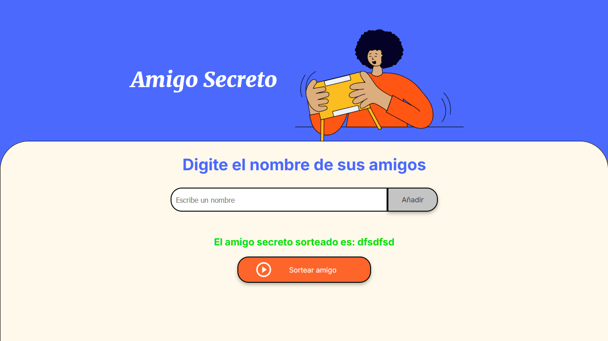

<h1><em>amigo secreto</em></h1>

   

# Taller de Estudio de JavaScript: Amigo Secreto

Este es un programa en JavaScript que permite recibir los nombres de un grupo de personas que participan en el juego del "Amigo Secreto" y luego sortea aleatoriamente quién será el amigo secreto de cada participante. El resultado se muestra en la pantalla.

## Descripción

El programa toma una lista de nombres y, mediante un algoritmo de sorteo aleatorio, asigna a cada persona un amigo secreto.
Esta es una aplicación ideal para organizar eventos como el "Amigo Secreto" en fiestas o reuniones.

## Funcionalidades

- **Entrada de Nombres**: Los usuarios ingresan los nombres de los participantes.
- **Sorteo Aleatorio**: El programa selecciona aleatoriamente un amigo secreto.
- **Resultado en Pantalla**: El nombre del amigosecreto se muestra en pantalla.

## Tecnologías Utilizadas

- **JavaScript**: Para la lógica de programación y el sorteo aleatorio.
- **HTML**: Para la estructura básica de la interfaz.
- **CSS**: Para el estilo visual.

## Instrucciones de Uso

1. **Introducir nombres**:
   Puede introducir el nombre de sus amigos en el entrada de texto y
   añadirlo con el boton situado a la derecha o con la tecla Enter
   
2. **Sortear amigo**:
  luego de tener añadidos todos los participantes en la lista usted podra hacer click en el boton "sortearamigo"
  con este sencillo  paso podra ver en pantalla a su amigo sereto

## Autor
 **Anuar Felipe Parejo Ochoa**

   

